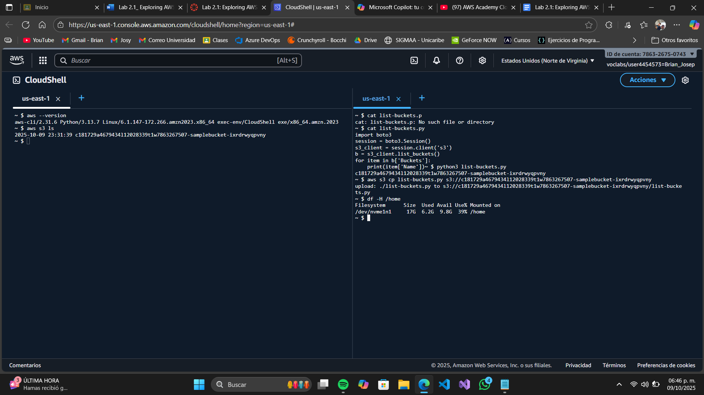
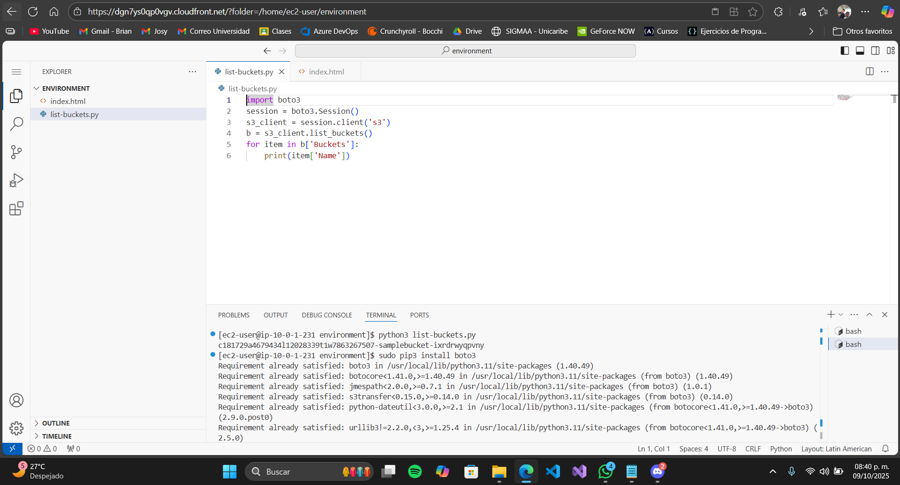
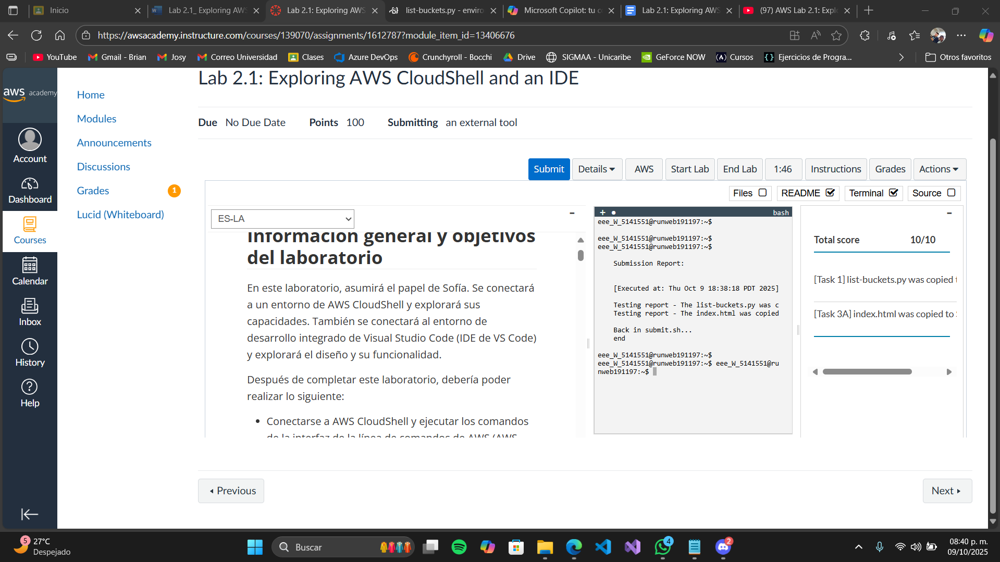

# Lab 2.1: Explorando AWS CloudShell y el IDE integrado

##  Objetivo
Familiarizarse con AWS CloudShell como entorno de desarrollo, verificar herramientas como AWS CLI y el SDK para Python, y practicar comandos básicos para interactuar con Amazon S3.

---

##  Parte 1: Acceder a la consola de AWS Academy

1. Haz clic en **Start Lab** en la parte superior de la página.
2. Espera hasta que aparezca el mensaje `Lab status: ready`.
3. Cierra el panel de inicio haciendo clic en la **X**.
4. Haz clic en el botón **AWS** para abrir la consola de administración.

---

##  Parte 2: Usar AWS CloudShell

1. En la consola de AWS, haz clic en el ícono de **CloudShell** (parte superior derecha).
2. Si aparece una ventana emergente de bienvenida, haz clic en **Close**.
3. Verifica que AWS CLI esté instalado:
   - Ejecuta: `aws --version`
   - Debes ver algo como: `aws-cli/2.x.x`
4. Prueba el acceso a S3:
   - Ejecuta: `aws s3 ls`
   - Deberías ver una lista de buckets S3 disponibles.
5. Ajusta el diseño de la terminal:
   - Ve a **Actions > Tabs layout > Split into columns**
6. Prueba el SDK de Python:
   - Crea un archivo llamado `list-buckets.py` con este contenido:

     ```python
     import boto3

     s3 = boto3.client('s3')
     response = s3.list_buckets()

     print("Buckets disponibles:")
     for bucket in response['Buckets']:
         print(f"- {bucket['Name']}")
     ```

   - Sube el archivo a CloudShell:
     - Ve a **Actions > Files > Upload file**
     - Selecciona `list-buckets.py` y haz clic en **Upload**
   - Ejecuta los siguientes comandos:
     - `cat list-buckets.py` → muestra el contenido
     - `python3 list-buckets.py` → ejecuta el script
     - Verifica que se impriman los nombres de los buckets
7. Copia el archivo al bucket S3:
   - Identifica el bucket que contiene `-sample-bucket-`
   - Ejecuta: `aws s3 cp list-buckets.py s3://<nombre-del-bucket>`
8. Verifica el almacenamiento de CloudShell:
   - Ejecuta: `df -H /home`

---


## 🧠 Parte 3: Usar el editor integrado (IDE de CloudShell)

1. Haz doble clic en el archivo `list-buckets.py` para abrirlo en el editor.
2. Verifica que el resaltado de sintaxis esté en Python:
   - Ve a **View > Syntax > Python**
3. Ejecuta el archivo desde el terminal o usando el botón de ejecución si está disponible.
4. Si aparece el error `ModuleNotFoundError: No module named 'boto3'`:
   - Instala el SDK: `sudo pip3 install boto3`
   - Vuelve a ejecutar el archivo: `python3 list-buckets.py`

---

## 📤 Parte 4: Subir un archivo HTML a S3

1. Crea un nuevo archivo HTML:
   - Ve a **File > New From Template > HTML File**
   - Escribe: `<body>Hello World</body>`
   - Guarda el archivo como `index.html`
2. Sube el archivo a S3:
   - Ejecuta: `aws s3 cp index.html s3://<nombre-del-bucket>`

---

## ✅ Finalización del laboratorio

- Verifica que los archivos se hayan subido correctamente.
- Cierra CloudShell si lo deseas.
- Marca el laboratorio como completado en la plataforma de AWS Academy.
