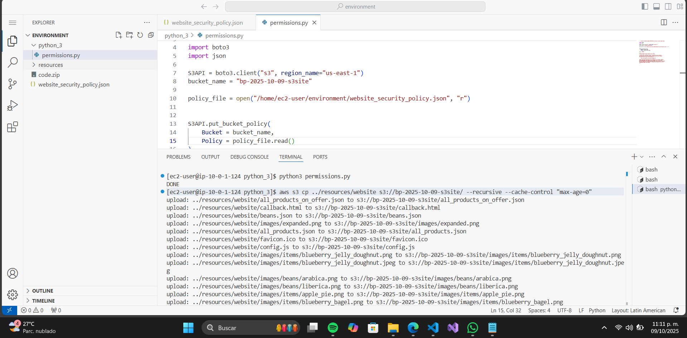

# Informe de Laboratorio AWS: Acceso y Configuración de un Sitio Web en S3

Este informe detalla los pasos para acceder a la Consola de Administración de AWS, configurar un entorno de AWS Cloud9 IDE, crear un bucket de S3, establecer permisos, cargar archivos de un sitio web y probar el sitio resultante. Se incluyen capturas de pantalla correspondientes a cada tarea para ilustrar los pasos clave. Las imágenes se encuentran en la carpeta `Imagenes/Lab3.1` y se referencian localmente (asegúrate de tener la estructura de carpetas correcta para visualizarlas en un visor de Markdown como VS Code).

## Tarea 1: Acceso a la Consola de Administración de AWS y Configuración del Entorno

### Pasos para Acceder a la Consola de Administración de AWS
1. Haz clic en **Iniciar Laboratorio** en la parte superior de las instrucciones para lanzar el laboratorio.
2. Espera hasta que aparezca el mensaje **Estado del laboratorio: listo**, luego cierra el panel de Iniciar Laboratorio haciendo clic en la **X**.
3. Haz clic en **AWS** en la parte superior para acceder a la Consola de Administración de AWS.


### Instalar el AWS SDK para Python
En la terminal Bash de Visual IDE, ejecuta:
```bash
sudo pip install boto3
```

### Descargar y Extraer Archivos del Laboratorio
1. Descarga los archivos ejecutando:
```bash
wget https://aws-tc-largeobjects.s3.us-west-2.amazonaws.com/CUR-TF-200-ACCDEV-2-91558/02-lab-s3/code.zip -P /home/ec2-user/environment
```
2. Extrae los archivos:
```bash
unzip code.zip
```

### Verificar la Versión de AWS CLI
Ejecuta:
```bash
aws --version
```


## Tarea 2: Creación de un Bucket de S3 Usando AWS CLI

### Crear un Bucket de S3
1. Ejecuta el siguiente comando, reemplazando `<bucket-name>` con un nombre formateado como: `<tus-iniciales>-<AAAA-MM-DD>-s3site` (Ejemplo: `sm-2022-08-26-s3site`):
```bash
aws s3api create-bucket --bucket <bucket-name> --region us-east-1
```

### Verificar el Bucket en la Consola de S3
1. Ve a **Servicios > S3** y confirma que el bucket ha sido creado.

### Actualizar Permisos del Bucket
1. Abre el bucket, ve a **Permisos** y haz clic en **Editar** en **Bloquear acceso público**.
2. Desmarca todas las opciones excepto:
   - Bloquear el acceso público a buckets y objetos otorgado a través de nuevas ACLs.
   - Bloquear el acceso público a buckets y objetos otorgado a través de cualquier ACL.
   - Bloquear el acceso público y entre cuentas a buckets y objetos a través de cualquier política de bucket o punto de acceso público.
3. Guarda los cambios y escribe `confirm` para confirmar.


## Tarea 3: Configuración de una Política de Bucket Usando el SDK para Python

### Crear un Documento de Política de Bucket
1. En el AWS Cloud9 IDE, crea un nuevo archivo llamado `website_security_policy.json`.
2. Reemplaza `<bucket-name>` con el nombre de tu bucket y `<ip-address>` con tu dirección IP pública (encuéntrala en whatismyip.com).

### Aplicar la Política de Bucket Usando Python
1. Abre `permissions.py` en el directorio `python_3` y reemplaza `<bucket-name>` con el nombre de tu bucket.
2. Guarda el archivo y ejecuta:
```bash
cd python_3
python3 permissions.py
```


## Tarea 4: Carga de Objetos al Bucket para Crear un Sitio Web

### Cargar los Archivos del Sitio Web
Ejecuta:
```bash
aws s3 cp ../resources/website s3://<bucket-name>/ --recursive --cache-control "max-age=0"
```



## Tarea 5: Prueba de Acceso al Sitio Web

### Cargar el Sitio Web
1. En la Consola de S3, ve a tu bucket, selecciona **Objetos** y actualiza si es necesario.
2. Abre `index.html` y copia la URL del objeto: `https://<bucket-name>.s3.amazonaws.com/index.html`.

### Probar el Acceso desde Fuera de tu Red
Ejecuta:
```bash
curl https://<bucket-name>.s3.amazonaws.com/index.html
```


## Tarea 6: Análisis del Código del Sitio Web

Abre los siguientes archivos en el directorio `resources > website`:
- `index.html`
- `config.js` (contiene opciones de configuración)
- `pastries.js`
- `all_products.json`


