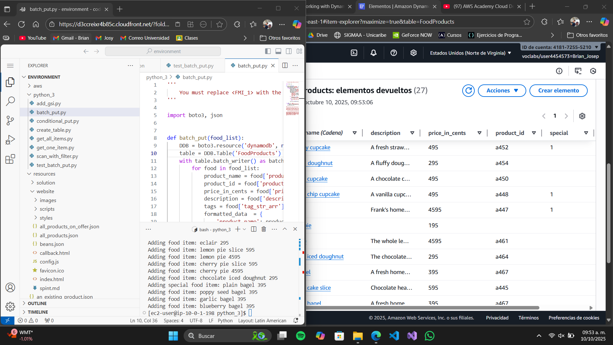
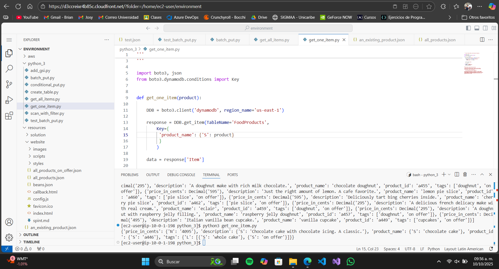

# Informe de Laboratorio AWS: Configuración y Gestión de una Tabla DynamoDB

Este informe detalla los pasos para acceder a la Consola de Administración de AWS, configurar un entorno de visual IDE, crear y gestionar una tabla en DynamoDB, realizar operaciones con datos, y agregar un índice secundario global. Se incluyen capturas de pantalla correspondientes a cada tarea para ilustrar los pasos clave. Las imágenes se encuentran en la carpeta `Imagenes/Lab5.1`.

## Tarea 1: Preparación del Laboratorio

### Conexión al Visual IDE# Informe de Laboratorio AWS: Configuración y Gestión de una Tabla DynamoDB

Este informe detalla los pasos para acceder a la Consola de Administración de AWS, configurar un entorno de AWS Cloud9 IDE, crear y gestionar una tabla en DynamoDB, realizar operaciones con datos, y agregar un índice secundario global.

## Tarea 1: Preparación del Laboratorio

### Conexión al Visual IDE
1. Desde el menú **Servicios**, busca y selecciona **Visual IDE**.

### Descargar y Extraer Archivos Requeridos
1. En la terminal, ejecuta:
```bash
wget https://aws-tc-largeobjects.s3.us-west-2.amazonaws.com/CUR-TF-200-ACCDEV-2-91558/03-lab-dynamo/code.zip -P /home/ec2-user/environment
```
2. Extrae el archivo:
```bash
unzip code.zip
```

### Actualizar Versiones de Python y AWS CLI
Ejecuta los siguientes comandos para establecer permisos y ejecutar el script:
```bash
chmod +x ./resources/setup.sh && ./resources/setup.sh
```


## Tarea 2: Creación de una Tabla DynamoDB Usando el SDK para Python

1. Abre la consola de DynamoDB desde **Servicios > DynamoDB**.
2. En el panel de navegación de DynamoDB, selecciona **Tablas**.

### Editar el Script para Crear la Tabla
1. En el AWS Cloud9 IDE, expande el directorio `python_3`.
2. Abre el script `create_table.py`.
3. Reemplaza `<FMI_1>` con el nombre de la tabla: `FoodProducts`.
4. Guarda el archivo: **Archivo > Guardar**.

### Ejecutar el Script
1. Navega al directorio `python_3` y ejecuta:
```bash
cd python_3
python3 create_table.py
```


## Tarea 3: Trabajo con Datos de DynamoDB – Entendiendo Expresiones de Condición

### Insertar un Nuevo Registro
1. En el AWS Cloud9 IDE, expande la carpeta `resources`.
2. Abre el archivo `not_an_existing_product.json`.
3. Ejecuta el siguiente comando para insertar el registro:
```bash
aws dynamodb put-item \
--table-name FoodProducts \
--item file://../resources/not_an_existing_product.json \
--region us-east-1
```

### Ver el Nuevo Registro
1. En la consola de DynamoDB, ve a **Explorador de ítems**.
2. Confirma que `FoodProducts` está seleccionada, selecciona **Escanear** y haz clic en **Ejecutar**.
3. Revisa los ítems devueltos.


## Tarea 4: Agregar y Modificar un Ítem Individual Usando el SDK

1. Abre el script `conditional_put.py` en el directorio `python_3`.
2. Reemplaza los marcadores `<FMI>` según las indicaciones.
3. Guarda el archivo: **Archivo > Guardar**.


## Tarea 5: Agregar Múltiples Ítems Usando el SDK y Procesamiento por Lotes

1. En el **Explorador de ítems** de DynamoDB, actualiza la vista seleccionando **Ejecutar**.
2. Elimina todos los registros:
   - Selecciona todos los registros de la tabla.
   - Desde el menú **Acciones**, selecciona **Eliminar ítem(s)**.
   - En el cuadro de confirmación, escribe `Delete` y selecciona **Eliminar ítems**.

### Actualizar el Script de Carga por Lotes
1. Abre el script `test_batch_put.py` en el directorio `python_3`.
2. Reemplaza `<FMI_1>` con `FoodProducts` y `<FMI_2>` con el nombre de la clave primaria `product_name`.
3. Guarda el archivo.

### Ejecutar el Script
Ejecuta:
```bash
python3 test_batch_put.py
```

### Modificar `batch_put.py`
1. Reemplaza `<FMI>` con `FoodProducts`.
2. Guarda el archivo y ejecútalo.



## Tarea 6: Consultar la Tabla Usando el SDK

1. Abre el script `get_all_items.py` en el directorio `python_3`.
2. Reemplaza `<FMI_1>` con `FoodProducts`.
3. Guarda el archivo y ejecuta:
```bash
python3 get_all_items.py
```

### Actualizar `get_one_item.py`
1. Reemplaza `<FMI_1>` con el nombre de la clave primaria de la tabla.
2. Guarda el archivo y ejecuta:
```bash
python3 get_one_item.py
```



## Tarea 7: Agregar un Índice Secundario Global a la Tabla

### Actualizar `add_gsi.py`
1. Reemplaza `<FMI_1>` con el `KeyType` de `HASH`.
2. Guarda el archivo y ejecuta:
```bash
python3 add_gsi.py
```

### Monitorear el Estado del Índice
1. En la consola de DynamoDB, selecciona **Tablas > FoodProducts > Pestaña de Índices**.
2. Espera hasta que el estado cambie de **Creando** a **Activo**.

### Actualizar `scan_with_filter.py`
1. Reemplaza `<FMI_1>` con `special_GSI` y `<FMI_2>` con `tags`.
2. Guarda el archivo y ejecuta:
```bash
python3 scan_with_filter.py
```


