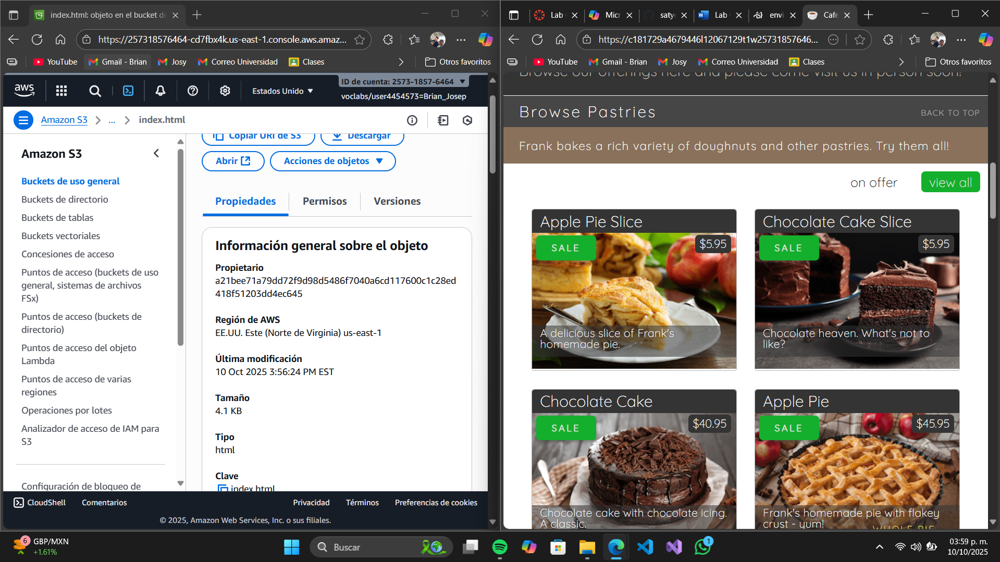
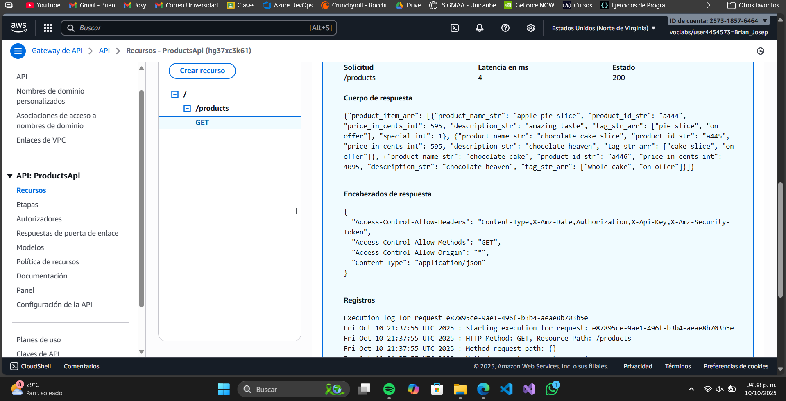
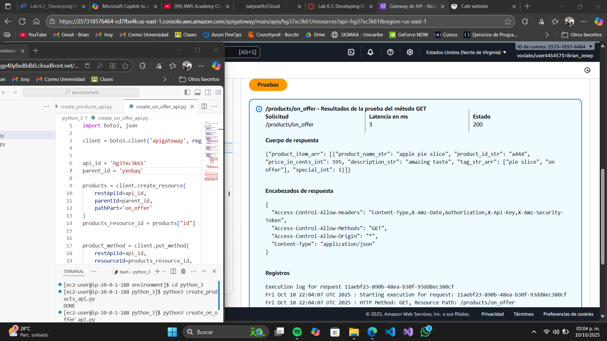
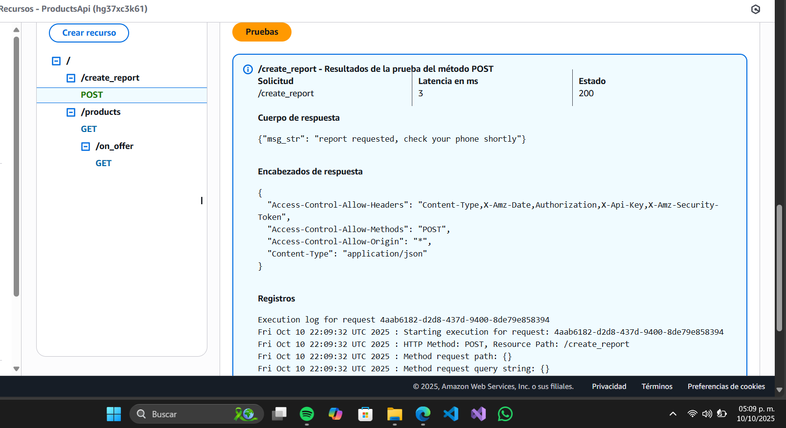
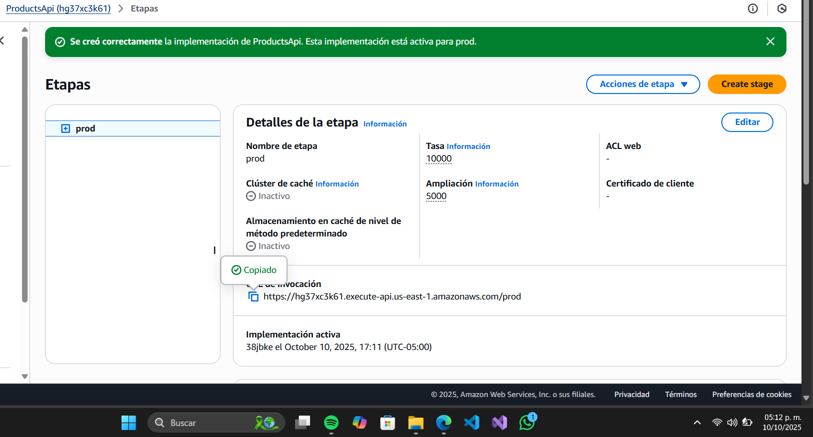
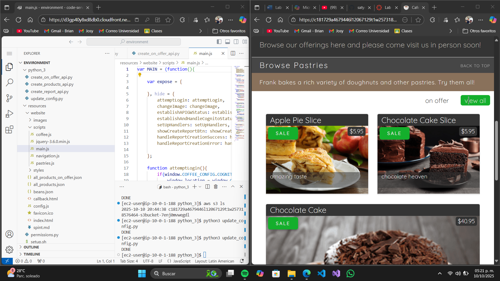

# Informe de Laboratorio AWS: Configuración y Despliegue de una API para un Sitio Web de Café

Este informe detalla los pasos para configurar un entorno de desarrollo en Visual Studio Code (VS Code) IDE, crear y probar endpoints de API Gateway, desplegar la API y actualizar un sitio web para integrarlo con la API. 

## Tarea 1: Preparar el Entorno de Desarrollo

En esta tarea, configurarás el entorno de desarrollo integrado de Visual Studio Code (IDE de VS Code) para crear la API REST.

### Conexión al IDE de VS Code
1. Selecciona **Details (Detalles)** > **AWS: Show (AWS: mostrar)** en la parte superior de las instrucciones.
2. Copia **LabIDEURL** y **LabIDEPassword** en un editor para usarlos más tarde.
3. Pega **LabIDEURL** en una nueva pestaña del navegador para abrir el IDE.
4. En la ventana **Welcome to code-server**, ingresa **LabIDEPassword** y selecciona **Submit (Enviar)**.

### Descargar y Extraer Archivos
1. En el terminal de VS Code, ejecuta:
```bash
wget https://aws-tc-largeobjects.s3.us-west-2.amazonaws.com/CUR-TF-200-ACCDEV-2-91558/04-lab-api/code.zip -P /home/ec2-user/environment
```
2. Extrae el archivo:
```bash
unzip code.zip
```

### Ejecutar el Script de Configuración
Ejecuta:
```bash
chmod +x resources/setup.sh && resources/setup.sh
```
Proporciona tu dirección IPv4 desde [whatismyip.com](https://whatismyip.com) cuando se solicite.

### Verificar la Configuración
1. Verifica la versión de AWS CLI (debe ser versión 2):
```bash
aws --version
```
2. Verifica el SDK para Python:
```bash
pip3 show boto3
```

### Verificar el Sitio Web de la Cafetería
1. En la Consola de Amazon S3, selecciona tu bucket, ve a **Objetos** y actualiza si es necesario.
2. Copia la **URL del objeto** de `index.html` (formato: `https://<bucket-name>.s3.amazonaws.com/index.html`).
3. Pega la URL en un navegador para confirmar que el sitio web carga.



## Tarea 2: Creación del Primer Endpoint de API (GET)

### Definir la API de Productos
1. En el IDE de VS Code, abre `python_3/create_products_api.py`.
2. Reemplaza `(fill me in)` en la línea 3 con el valor correcto del cliente de API Gateway (consulta la documentación del SDK de Python).
3. Guarda y ejecuta:
```bash
cd python_3
python3 create_products_api.py
```

### Probar la API en API Gateway
1. En la Consola de API Gateway, selecciona **ProductsApi**.
2. Selecciona el método **GET** bajo el recurso `products`.
3. Haz clic en **TEST**, desplázate hacia abajo y selecciona **Probar**.



## Tarea 3: Creación del Segundo Endpoint de API (GET)

### Definir el Recurso `/on_offer`
1. Abre `python_3/create_on_offer_api.py`.
2. Reemplaza `<FMI_1>` y `<FMI_2>` con `api_id` y `parent_id`.
3. Guarda y ejecuta:
```bash
python3 create_on_offer_api.py
```

### Probar el Recurso `/on_offer`
1. En la Consola de API Gateway, navega a **ProductsApi > /on_offer > GET**.
2. Usa el enlace **TEST** para verificar la respuesta simulada.



## Tarea 4: Creación del Tercer Endpoint de API (POST)

### Definir el Recurso `/create_report`
1. Abre `python_3/create_report_api.py`.
2. Reemplaza `<FMI_1>` con el `api_id` (obtén con el CLI si es necesario):
```bash
aws apigateway get-rest-apis --query items[0].id --output text
```
3. Guarda y ejecuta:
```bash
python3 create_report_api.py
```

### Probar el Recurso `/create_report`
1. En la Consola de API Gateway, navega a **ProductsApi > /create_report > POST**.



## Tarea 5: Despliegue de la API

1. En la Consola de API Gateway, selecciona la raíz `/` bajo **Recursos**.
2. Selecciona **Acciones > Desplegar API** y completa:
   - **Etapa de despliegue**: [Nueva Etapa]
   - **Nombre de la etapa**: `prod`
3. Haz clic en **Desplegar** y copia la **URL de invocación**.



## Tarea 6: Actualización del Sitio Web

### Actualizar el Archivo `config.js`
1. Abre `resources/website/config.js`.
2. Reemplaza `null` con la **URL de invocación** (entre comillas).
3. Guarda el archivo.

### Actualizar el Archivo de Configuración en S3
1. Abre `python_3/update_config.py`.
2. Reemplaza `<FMI_1>` con el nombre de tu bucket (usa el CLI):
```bash
aws s3 ls
```
3. Guarda y ejecuta:
```bash
python3 update_config.py
```

### Probar el Sitio Web
1. Actualiza el sitio web del café en tu navegador.
2. Verifica que el sitio web ahora utiliza la API.


