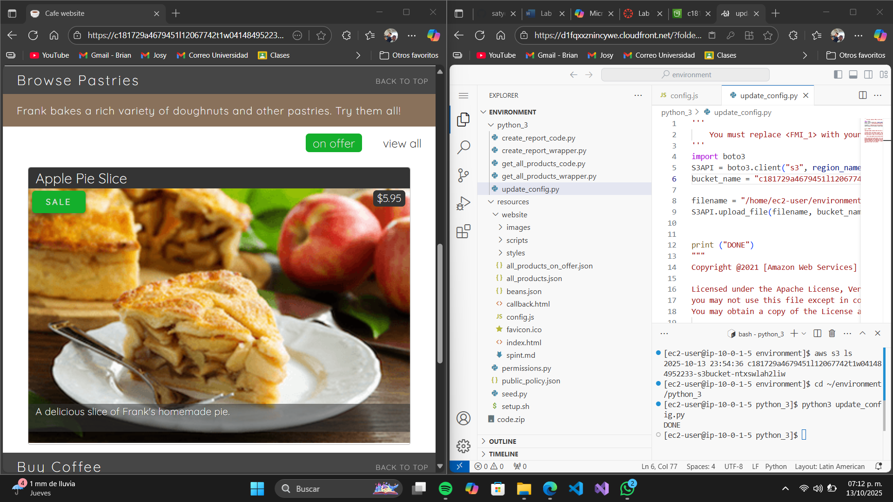
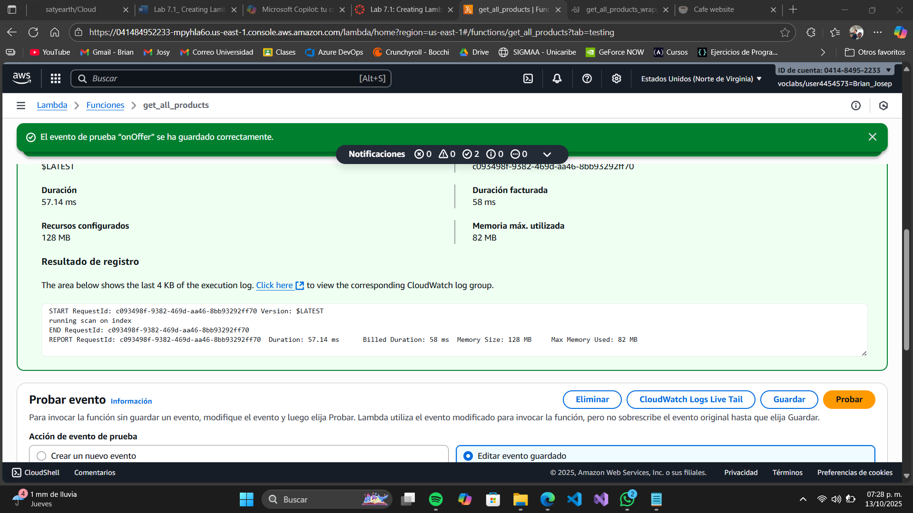
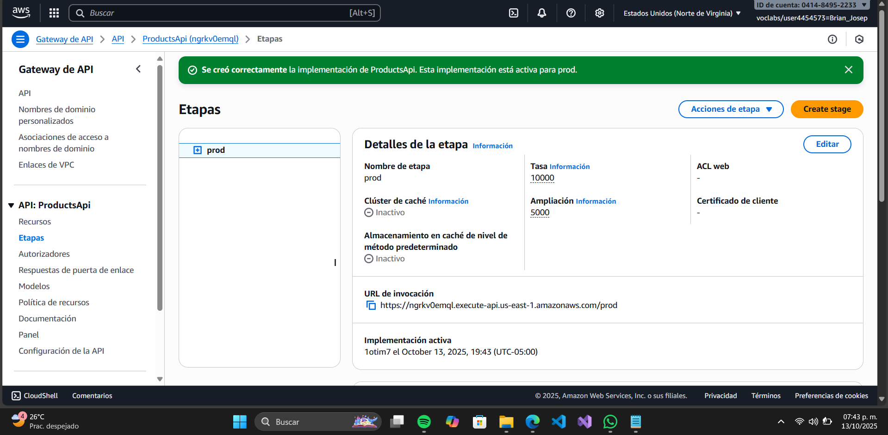
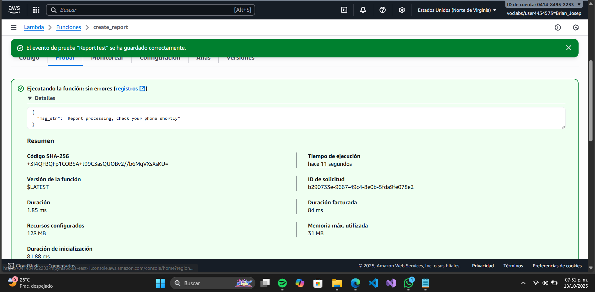
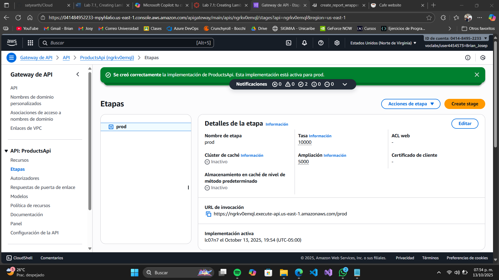
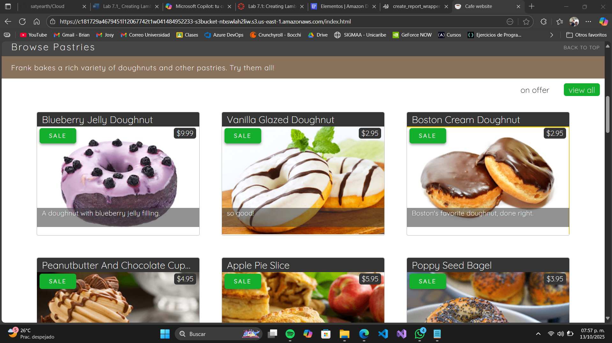

# Informe de Laboratorio AWS: Creación y Configuración de Funciones Lambda para un Sitio Web de Café

Este informe detalla los pasos para configurar un entorno de desarrollo en AWS Cloud9, crear y probar funciones Lambda, integrarlas con una API REST en API Gateway, y actualizar un sitio web para reflejar cambios en DynamoDB. Se incluyen capturas de pantalla correspondientes a cada tarea para ilustrar los pasos clave. Las imágenes se encuentran en la carpeta `Imagenes/Lab7.1` y se referencian localmente.

## Tarea 1: Configuración del Entorno de Desarrollo

En esta tarea, configurarás el entorno de desarrollo integrado de Visual Studio Code (IDE de VS Code) para crear funciones Lambda.

### Conexión al IDE de VS Code
1. Selecciona **Details (Detalles)** > **AWS: Show (AWS: mostrar)** en la parte superior de las instrucciones.
2. Copia **LabIDEURL** y **LabIDEPassword** en un editor.
3. Pega **LabIDEURL** en una nueva pestaña del navegador para abrir el IDE.
4. En la ventana **Welcome to code-server**, ingresa **LabIDEPassword** y selecciona **Submit (Enviar)**.

### Descargar y Extraer Archivos
1. En el terminal del IDE de VS Code, ejecuta:
```bash
wget https://aws-tc-largeobjects.s3.us-west-2.amazonaws.com/CUR-TF-200-ACCDEV-2-91558/05-lab-lambda/code.zip -P /home/ec2-user/environment
```
2. Extrae los archivos:
```bash
unzip code.zip
```

### Ejecutar el Script de Configuración
Ejecuta:
```bash
chmod +x ./resources/setup.sh && ./resources/setup.sh
```
Proporciona tu dirección IPv4 desde [whatismyipaddress.com](https://whatismyipaddress.com) cuando se solicite (no uses `0.0.0.0`).

### Verificar la Instalación del SDK
Verifica la instalación del SDK de Python (`boto3`):
```bash
pip3 show boto3
```
Ignora cualquier mensaje sobre una versión antigua de `pip`.

### Confirmar Recursos
1. **Bucket de S3**:
   - En la consola de S3, selecciona el bucket, elige `index.html`, copia la **URL del objeto** y cárgala en un navegador para verificar el sitio web.
2. **DynamoDB**:
   - En la consola de DynamoDB, selecciona **Tablas > FoodProducts > Explorar elementos** y confirma los datos del menú.
   - En **Ver detalles de la tabla > Índices**, verifica el índice `special_GSI`.
3. **API Gateway**:
   - En la consola de API Gateway, selecciona **ProductsApi** y verifica los métodos:
     - **GET** para `/products` y `/products/on_offer`.
     - **POST** y **OPTIONS** para `/create_report`.
   - Prueba cada método con el menú **PRUEBAS** para confirmar que devuelven un código de estado 200.

### Copiar la URL de Invocación
1. En API Gateway, selecciona **Etapas > prod**.
2. Copia la **URL de invocación** (ignora advertencias sobre permisos `ListWebACLs` o `AssociateWebACL`).

### Actualizar el Archivo `config.js`
1. Abre `resources/website/config.js`.
2. Reemplaza `null` con la **URL de invocación** (entre comillas dobles, asegurándote de que termine en `/prod` sin barra final).
   Ejemplo:
   ```javascript
   window.COFFEE_CONFIG = {
     API_GW_BASE_URL_STR: "https://<some-value>.execute-api.us-east-1.amazonaws.com/prod",
     COGNITO_LOGIN_BASE_URL_STR: null
   };
   ```
3. Guarda el archivo.

### Actualizar y Ejecutar el Script de Configuración
1. Abre `python_3/update_config.py`.
2. Reemplaza `<FMI_1>` con el nombre del bucket de S3 (encuéntralo con `aws s3 ls`).
3. Ejecuta:
```bash
cd ~/environment/python_3
python3 update_config.py
```

### Verificar el Sitio Web
1. En la consola de S3, copia la **URL del objeto** de `index.html` y cárgala en un navegador.
2. Actualiza la página y verifica la sección **Browse Pastries** (debería mostrar un elemento del menú).



## Tarea 2: Creación de una Función Lambda para Recuperar Datos de DynamoDB

### Editar el Código de la Función Lambda
1. Abre `python_3/get_all_products_code.py`.
2. Reemplaza `<FMI_1>` y `<FMI_2>` con los valores apropiados de DynamoDB.

### Probar el Código Localmente
1. Ejecuta:
```bash
cd ~/environment/python_3
python3 get_all_products_code.py
```
El resultado debe mostrar datos de DynamoDB en formato JSON.

### Modificar el Código para Pruebas
1. Modifica temporalmente la condición `if offer_path_str is None:`.
2. Ejecuta el código nuevamente y observa que se devuelven menos ítems.
3. Revierte los cambios.

### Preparar el Código de Lambda
1. Abre `python_3/get_all_products_wrapper.py` y actualiza con el ARN del rol IAM.
2. Empaqueta el código:
```bash
zip get_all_products_code.zip get_all_products_code.py
```

### Subir el Código a S3
Sube el archivo `.zip` al bucket:
```bash
aws s3 cp get_all_products_code.zip s3://<bucket-name>
```

### Crear la Función Lambda
Ejecuta:
```bash
python3 get_all_products_wrapper.py
```

### Probar la Función Lambda
Verifica que la función Lambda funcione correctamente.



## Tarea 3: Configuración de la API REST para Invocar la Función Lambda

### Probar la API Existente
1. En API Gateway, prueba el método **GET** de `/products` y confirma que devuelve datos simulados.

### Integrar Lambda con la API
1. Reemplaza el endpoint simulado con la función Lambda en el método **GET** de `/products`.
2. Guarda y prueba la API.

### Habilitar CORS para `/products`
1. Habilita CORS en el método **GET** de `/products` agregando el encabezado `Access-Control-Allow-Origin`.

### Actualizar el Método `/on_offer`
1. Configura el método **GET** de `/on_offer` para invocar la misma función Lambda.
2. Habilita CORS.

### Configurar Plantillas de Mapeo
Para `/on_offer`, agrega una plantilla de mapeo:
```json
{
  "path": "$context.resourcePath"
}
```

### Desplegar la API
1. En **Recursos**, selecciona la raíz `/`.
2. Selecciona **Desplegar API**, elige `prod` y haz clic en **Desplegar**.



## Tarea 4: Creación de una Función Lambda para Solicitudes de Reportes

### Abrir el Código de Lambda
1. Abre `python_3/create_report_code.py`.

### Ejecutar el Código Localmente
Ejecuta:
```bash
python3 create_report_code.py
```

### Comentar la Última Línea
1. Comenta: `# print(lambda_handler(None, None))`.
2. Guarda.

### Editar el Código del Wrapper
1. Abre `python_3/create_report_wrapper.py` y reemplaza `<FMI_1>` con el ARN del rol `LambdaAccessToDynamoDB`.
2. Guarda.

### Empaquetar y Subir el Código
1. Empaqueta:
```bash
zip create_report_code.zip create_report_code.py
```
2. Sube al bucket:
```bash
aws s3 cp create_report_code.zip s3://<bucket-name>
```

### Crear la Función Lambda
Ejecuta:
```bash
python3 create_report_wrapper.py
```

### Probar la Función Lambda
1. En la consola de Lambda, selecciona `create_report`.
2. Abre `create_report_code.py`, selecciona **Probar**, nombra el evento `ReportTest` y guárdalo.



## Tarea 5: Configuración de la API REST para Invocar la Función Lambda para Reportes

### Probar el Método POST Existente
1. En API Gateway, selecciona **ProductsApi > /create_report > POST**.

### Reemplazar el Endpoint Simulado con Lambda
1. En **POST**, selecciona **Integration Request > Editar**:
   - **Tipo de integración**: Función Lambda
   - **Región de Lambda**: us-east-1
   - **Función Lambda**: create_report
2. Guarda.

### Probar el Método POST
Prueba el método **POST**.

### Desplegar la API
1. En **Recursos**, selecciona la raíz `/`.
2. Selecciona **Desplegar API**, elige `prod` y haz clic en **Desplegar**.



## Tarea 6: Prueba de la Integración Usando el Sitio Web de la Cafetería

### Cargar el Sitio Web
1. Regresa a la pestaña del sitio web de la cafetería y actualiza.
2. Alternativamente, en la consola de S3, copia la **URL del objeto** de `index.html`.

### Probar el Filtro de Menú
1. En **Browse Pastries**, haz clic en **view all** y verifica que aparezcan más elementos.

### Actualizar el Precio en DynamoDB
1. En la consola de DynamoDB, cambia el valor `price_in_cents` de un ítem.
2. Guarda y recarga el sitio web para verificar el cambio.



